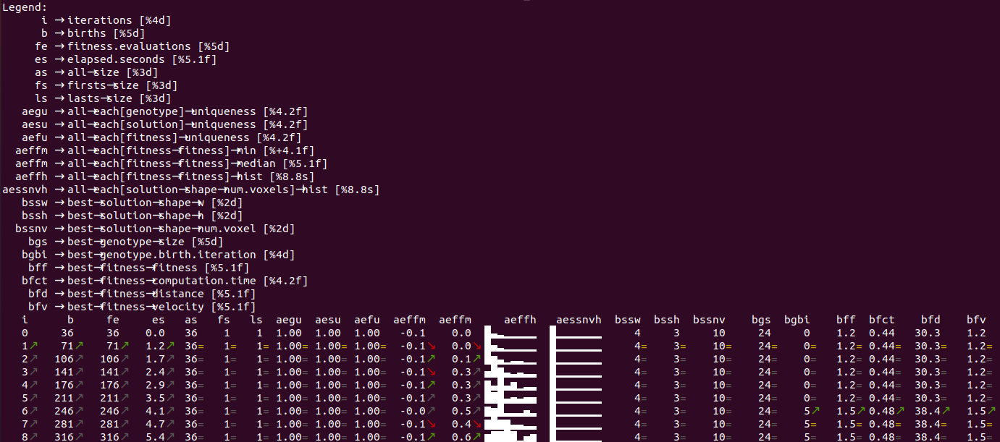

class: middle, center

# JGEA: a Modular Java Framework for Experimenting with Evolutionary Computation

Eric Medvet<sup>1</sup>, **Giorgia Nadizar**<sup>2</sup>, Luca Manzoni<sup>2</sup>

<font size="2"><sup>1</sup>Department of Engineering and Architecture, University of Trieste, Italy  <br/>
<sup>2</sup>Department of Mathematics and Geosciences, University of Trieste, Italy  
</font>

EvoSoft (@Gecco), Boston (USA), 09/07/2022

---

## First things first

Hey Google, tell me about "best software for evolutionary computation"

<p align="center">
  
</p>

---

## Yet another EC framework?

- EC is a complex domain $\rightarrow$ many *heterogeneous* elements
- Clean modeling of core concepts required
- Target-oriented  <br/><br/>
- **Solid**
  - EC as problem-solving tool
  - Require built-in algorithms <br/><br/>
- **Extensible**
  - Ease of new algorithm implementation
  - Availability of already written benchmarks

---

## JGEA framework

- Java SE 17
  - Object-orientation $\rightarrow$ models well complex and variegate concepts
  - Adequate syntactic constructs (generics, interfaces)
  - Portable
- Modular
- Abstraction levels, down to implementation
- Suite of benchmarks

---

## Structure and components

EAs are a class of population-based optimization algorithms.

As such, they **solve** optimization **problems**.

We translate this into a hierarchy of interfaces, rooted in `Problem` and `Solver`.

---

## Problem hierarchy (1)

```java
public interface Problem<S> extends PartialComparator<S> {}
```
- `S` solution space
- `PartialComparator<S>` to compare two solutions

<br/>

Solutions might be compared according to their *quality*:
```java
public interface QualityBasedProblem<S, Q> extends Problem<S> {
  Function<S, Q> qualityFunction();
  PartialComparator<Q> qualityComparator();
}
```
- `Q` quality/fitness space
- `Function<S, Q>` mapping a solution to a quality value
- `PartialComparator<Q>` for comparing qualities

---

## Problem hierarchy (2)

We might want to enforce *total ordering* among qualities:
```java
public interface TotalOrderQualityBasedProblem<S, Q> extends QualityBasedProblem<S, Q> {
  Comparator<Q> totalOrderComparator();
  @Override
  default PartialComparator<Q> qualityComparator() { /*...*/ }
}
 ```
- `Comparator<Q>` for comparing qualities (total ordering enforced)

---

## Problem hierarchy (3)

Qualities might be *naturally comparable*:
```java
public interface ComparableQualityBasedProblem<S, Q extends Comparable<Q>>
  extends TotalOrderQualityBasedProblem<S, Q> {
  @Override
  default Comparator<Q> totalOrderComparator() {
    return Comparable::compareTo;
  }
}
```
- Qualities are compared according to their natural ordering
---

## Problem hierarchy (recap)

```java
public interface Problem<S> extends PartialComparator<S> {}
```
$$\downarrow$$
```java
public interface QualityBasedProblem<S, Q> extends Problem<S> {}
```
$$\downarrow$$
```java
public interface TotalOrderQualityBasedProblem<S, Q> extends QualityBasedProblem<S, Q> {}
```
$$\downarrow$$
```java
public interface ComparableQualityBasedProblem<S, Q extends Comparable<Q>>
  extends TotalOrderQualityBasedProblem<S, Q> {}
```

---

## Solver hierarchy (1)

```java
public interface Solver<P extends Problem<S>, S> {
  Collection<S> solve(
      P problem,
      RandomGenerator random,
      ExecutorService executor
  ) throws SolverException;
}
```
- Solves problem of type `P`
- Provides the caller with solutions of type `S`
- `RandomGenerator` for *repeatability*
- `ExecutorService` for distributing computation (aimed at *efficiency*)
- *Stateless* nature

---

## Solver hierarchy (2)

All relevant EAs share an *iterative* structure:

```java
public interface IterativeSolver<T, P extends Problem<S>, S> extends Solver<P, S> {
  default Collection<S> solve(
      P problem, RandomGenerator random,
      ExecutorService executor, Listener<? super T> listener
  ) throws SolverException {
    T state = `init`(problem, random, executor);
    listener.listen(state);
    while (!`terminate`(problem, random, executor, state)) {
      `update`(problem, random, executor, state);
      listener.listen((T) state.immutableCopy());
    }
    listener.done();
    return `extractSolutions`(problem, random, executor, state);
  }
}
```
- `T` state $\rightarrow$ different solvers might require to store different structures

---

## Solver hierarchy (3)

```java
public abstract class AbstractPopulationBasedIterativeSolver<
    T extends POSetPopulationState<G, S, Q>, P extends QualityBasedProblem<S, Q>, G, S, Q>
    implements IterativeSolver<T, P, S> {
  /*...*/
}
```
- `init()` $\rightarrow$ initialize the state and sample initial population
- `terminate()` $\rightarrow$ check termination condition
- `extractSolutions()` $\rightarrow$ take the best individual(s) from the population
<br/><br/>
- `update()` not implemented $\rightarrow$ characterizes each EA

---

## Solver hierarchy (recap)

```java
public interface Solver<P extends Problem<S>, S> {}
```
$$\downarrow$$
```java
public interface IterativeSolver<T, P extends Problem<S>, S> extends Solver<P, S> {}
```
$$\downarrow$$
```java
public abstract class AbstractPopulationBasedIterativeSolver<
    T extends POSetPopulationState<G, S, Q>, P extends QualityBasedProblem<S, Q>, G, S, Q>
    implements IterativeSolver<T, P, S> {}
```

---

## Individual

Capture genotype-phenotype representation
```java
public record Individual<G, S, Q>(
    G genotype,
    S solution,
    Q fitness,
    long fitnessMappingIteration,
    long genotypeBirthIteration
)
```

---

## Individual creation

1. Obtain a genotype

- *From scratch*

```java
public interface Factory<T> {
  List<T> build(int n, RandomGenerator random);
}
```
  - *With genetic operators*

```java
public interface GeneticOperator<G> {
  List<? extends G> apply(List<? extends G> parents, RandomGenerator random);
  int arity();
}
```

<ol start="2">
  <li>Map it to a phenotype</li>
  <li>Evaluate its fitness</li>
</ol>

---

## Individual selection

Selection for reproduction or survival
```java
public interface Selector<T> {
  <K extends T> K select(
      PartiallyOrderedCollection<K> ks,
      RandomGenerator random
  );
}
```

---

## Listener

Need to *track* the execution of the solver, extracting and saving information during a run:
```java
public interface Listener<E> {
  void listen(E e);
  default void done() {}
}
```

Used to `listen()` to updates of the state during an execution of the `solve()` method.

A `ListenerFactory` can build *augmented* listeners:
```java
public interface ListenerFactory<E, K> {
  Listener<E> build(K k);
}
```

---

## Listener example

Tabular printer, to print the evolutionary progress on screen

<p align="center">
  
</p>

---

## Case study 1: experimenting with JGEA

Testing the **solidity** of JGEA.

1. Problem definition
  - Choose solution space `S`
  - Decide which `Problem` to implement (along the hierarchy)
2. Choose an appropriate solver
  - Select an encoding (i.e., a genotype `G`)
  - Define a genotype-phenotype mapping
  - Select an appropriate EA for the chosen genotype
3. Carry out the experimental evaluation
  - (Optional) Choose a `Listener` to monitor the execution

---

## Case study 2: adding a new EA to JGEA

Testing the **extensibility** of JGEA.

1. Formally define the EA
  - Define it in natural language or in pseudo-code
2. Frame the EA as a class extending `AbstractPopulationBasedIterativeSolver`
  - Match subroutines like `init()`, `terminate()`, `update()`, and `extractSolutions()`
3. Implement the class
  - Choose the allowed generics parameters in the class signature
  - Identify any additional elements needed (as fields of the class)
  - Implement the `update()` method (and `@Override` other methods if needed)
  to give functionalities
4. Test the implemented EA on a benchmark

---
# Summing up... did I convince you?

JGEA is
- Solid <span>&#10004;</span>
- Extensible <span>&#10004;</span>

Thanks to modularity, abstraction, and a clear modeling of concepts.

<br/><br/>

And if you liked it, you're welcome to join us
.cols[
.c50[
<i class="fa fa-github" aria-hidden="true"></i>
[github.com/ericmedvet/jgea](https://github.com/ericmedvet/jgea)
]
.c50[
<i class="fa fa-file-text" aria-hidden="true"></i>
[medvet.inginf.units.it/jgea/](https://medvet.inginf.units.it/jgea/)
]
]

---
class: middle, center

# Thanks!

Any unanswered questions?

<i class="fa fa-envelope" aria-hidden="true"></i> [giorgia.nadizar@phd.units.it](mailto:giorgia.nadizar@phd.units.it)

<i class="fa fa-link" aria-hidden="true"></i> [giorgia-nadizar.github.io](https://giorgia-nadizar.github.io/)
