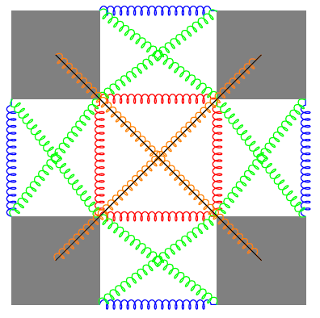

class: middle, center

# Evolutionary Robotics and other stories

.h10ex[]
.hspace5[]
.h10ex[]

**Giorgia Nadizar**, giorgia.nadizar@phd.units.it

Evolutionary Robotics and Artificial Life Lab, University of Trieste, Italy

---

# Who am I?

- Computer Engineering background
- PhD student at the Evolutionary Robotics and Artificial Life Lab
(University of Trieste) under the supervision of Eric Medvet and Stefano
Nichele (from Østfold University College)
- Currently, PhD intern at Centrum Wiskunde & Informatica with Marco Virgolin

---

# Bio-inspired Embodied AI

- Why embodied AI?
  - Intelligence developed within a body
  - Body as a substrate for computation → morphological computation
  - Body as "fuzzy" boundary between environment and brain

- How to achieve it?
  - Take inspiration from the biological world → mimic _evolution_

---

# ...in practice

**Evolutionary Computation** in various flavors

1. Evolutionary Robotics (ER) → our specialty back in Trieste
2. Interpretable AI (Symbolic Regression) → currently at CWI

---
class: middle, center
name: ml-definitions

# Evolutionary Robotics

---

# Voxel-based Soft Robots (VSR)

Probably heard _waaaay_ too much about them, but just in case, let's recap

.h15ex.center[
<video width="450" height="260" autoplay loop>
  <source src="videos/vsr-elephant.mp4" type="video/mp4">
</video>
]

---

# Relevance

- Combination of softness and modularity → large design freedom
- Reconfigurability, self-assembly → robot factory
- Embodied cognition paradigm → intelligence does not only reside in the brain
- Bio-inspired features → study real world phenomena for ALife

---

# VSRs in simulation

- Rigid bodies → endow with mass, prevent excessive deformation
- Springs → alter the area, mimic softness

.h30ex.center[]

---

# How do they move?

- Contraction and expansion of each voxel → similar to muscles
- Control signal deriving from a controller
  - Open-loop → signal computed from a periodic function
  - Closed-loop → processes sensor readings

---

# Centralized neural controller

- It gives the robot a "brain"
- ...but it fails modularity

.center.h30ex[]

.footnote[Evolutionary Synthesis of Sensing Controllers for Voxel-based Soft Robots; Talamini, Medvet, Bartoli, De Lorenzo]

---

# Distributed neural controller

- Embracing modularity → each voxel can be an agent itself (almost!)

.center.h30ex[]

.footnote[Evolution of Distributed Neural Controllers for Voxel-based Soft Robots; Medvet, Bartoli, De Lorenzo, Fidel]

---

# ...many variants of _collective control_

.cols[
.c20[.center[
Hetero distributed
.w25p[]
]]
.c20[.center[
Homo distributed
.w25p[]
]]
.c20[.center[
NCA-like distributed
.w25p[]
]]
]

---

# Spiking Neural Networks

.center.h25ex[]

- Model membrane potential of neurons over time
- Allow plasticity mechanisms
- Encode information differently → conversion required

---

# Spiking Embodied NCA

- Instantiate distributed controllers with SNNs
- Conversion of sensory inputs and control outputs
- Communication in terms of spike trains

.footnote[Collective control of modular soft robots via embodied Spiking Neural Cellular Automata; Nadizar, Medvet, Nichele, Pontes-Filho]

---

# Does it work?

- Task of locomotion
  - Flat terrain during evolution
  - Rougher terrains to test generalization

.center.h30ex[]

---

# What is the key of success?

.center.h30ex[]

- Having a state increases performance (RNNs win)
- But SNNs lead to more natural behaviors → less prone to reality gap

---
class: middle, center
name: ml-definitions

# Interpretable AI

---

# What does it have to do with Embodied AI?

- AI within a body, e.g., a robot → possibly great impacts on real world

.center[]

- _Understanding_ how it works is of paramount importance

---

# Starting simple: interpretable symbolic formulae

- Symbolic Regression to find them → Genetic Programming with two objectives
  - Accurate → MSE, RMSE, ...
  - Interpretable → ?

- Key points:
  - What is interpretability?
  - How can we quantify it?

---

# Interpretability is subjective

- Human-in-the-loop system
- Ask feedback on models found by GP
- Use feedback to train an estimator, i.e., a neural network

.center[]

.footnote[Model Learning with Personalized Interpretability Estimation (ML-PIE); Virgolin, De Lorenzo, Randone, Medvet, Wahde]

---

# Current research directions

- Generalize model encoding
  - Not only features for formulae
- Validate the approach against (a lot of) simulated users
  - How can we simulate them, if we don't know what interpretability is?
- Study on how users behavior influences the search
  - Are all users equally dedicated to giving feedback?

---

# Can we bring this to robotics?

- ...why not!

- Some open points:
  - What type of interpretability are we aiming at?
  - How to "encode" a robot? Or maybe its controller? Or its behavior?
  - Is it computationally viable?

---

class: center

# Thanks!

.center.h30ex[]

<i class="fa fa-envelope" aria-hidden="true"></i> [giorgia.nadizar@phd.units.it](mailto:giorgia.nadizar@phd.units.it)
